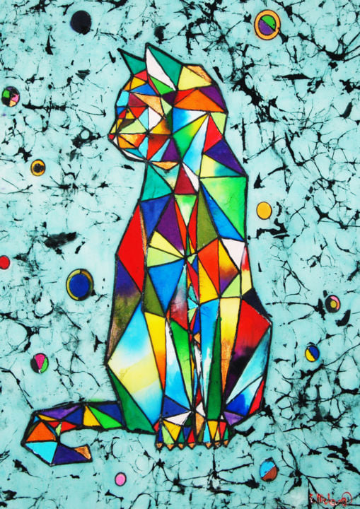

# DiffuserCam Project (COM-514)

##### Axel Dinh Van Chi, Daniel Suter, Stasa Kostic, Andjela Kostic.

<br>

We provide different ways to recover images taken from a lensless camera. 
We created a mini dataset of 5 images, here is an example:

  
  

One of the images could not be shown because of its format (".tif").

Those results can be made using the following files:

- **ridge_myDataset.py**
- **lasso_myDataset.py**
- **non_neg_ls_myDataset.py** 
- **penalized_ls_myDataset.py**
- **huber_ridge_myDataset.py**

For each of those files it is possible to recover the evaluation of the method by calling (we use one particular file for the example here):
```
python scripts/ridge_myDataset.py --data myDataset --save
```
Doing so all the reconstructions will be made and saved, this can quite long as 500 iterations are performed for APGD and 5000 for PDS algortihms.

It is also possible to use:
```
python scripts/ridge_myDataset.py --data myDataset --load
```
Here the the metrics are directly computed on the pre-computed images reconstructions. We recommend to use this option.

The returned metrics are:
  - The MSE.
  - The PSNR.
  - The SSIM.
  - The LPIPS.

Their implementations can be found in diffcam/metric.py

Furthermore, notice that the code for the Discrete Cosine Transform method is not implemented using the required change of variable, hence it uses the PDS algorithm. Also note that it does not have a corresponding python script to compute the metrics on their reconstructions. 
