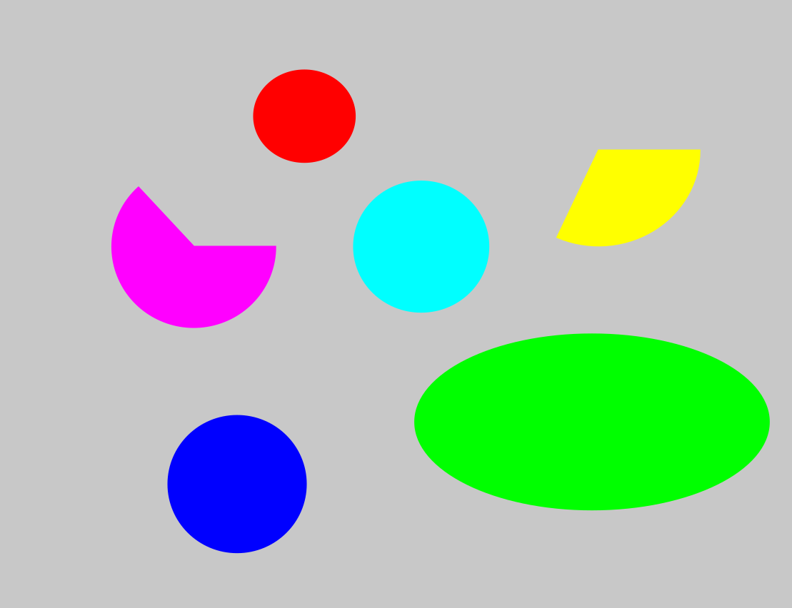

# DiffuserCam Project (COM-514)

##### Axel Dinh Van Chi, Daniel Suter, Stasa Kostic, Andjela Kostic.

<br>

We provide in this project different ways to recover images taken from a lensless camera.
For more information about the setup and requirements please refer to the Setup section of the [DiffuserCam](https://github.com/LCAV/DiffuserCam) repository.

# Data

We created a mini dataset of 5 images, here is an example:

  
  

One of the images could not be shown because of its format (".tif").

Those images are stored in the **myDataset/original** folder. One can also find the measurements made using those same images in **myDataset/raw_data** and the Point Spread Function measurements as the **myDataset/psf.png** file.

# Scripts

The results can be reproduced using the following files:

- **ridge_myDataset.py**
- **lasso_myDataset.py**
- **non_neg_ls_myDataset.py** 
- **penalized_ls_myDataset.py**
- **huber_myDataset.py**

For each of those files it is possible to recover the evaluation of the method by calling (we use one particular file for the example here):
```
python scripts/ridge_myDataset.py --data myDataset --save
```
Doing so all the reconstructions will be made and saved, this can be quite long as 500 iterations are performed for Accelerated Proximal Gradient Descent and 5000 for the Primal-Dual Splitting method.

It is also possible to use:
```
python scripts/ridge_myDataset.py --data myDataset --load
```
Here the the metrics are directly computed on the pre-computed images reconstructions. We recommend to use this option. Nevertheless, the time taken to reconstruct the images will not be given.

The returned metrics are:
  - The MSE.
  - The PSNR.
  - The SSIM.
  - The LPIPS.

Their implementations can be found in diffcam/metric.py

# ISSUES

Notice that the code for the Discrete Cosine Transform method is not implemented using the required change of variable, hence it uses the PDS algorithm. Also note that it does not have a corresponding python script to compute the metrics on their reconstructions. 
